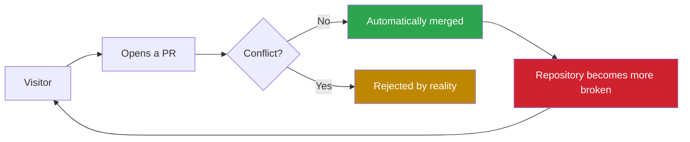

# Break This Repository!

another try


So `README.MD` has a higher priority than `README.md`?

---

## 💥 Live Repository Destruction Pipeline



## 🌓 Theme-Sensitive Repository Owner

The owner shown below depends on your GitHub theme:

<picture>
  <source
    media="(prefers-color-scheme: dark)"
    srcset="./1786763623934.jpg">
  <source
    media="(prefers-color-scheme: light)"
    srcset="./cat.jpeg">
  
</picture>

<details>
<summary><strong>⚠️ DO NOT CLICK — CLASSIFIED INFORMATION</strong></summary>

## You clicked it.

The repository has recorded your curiosity.

```text
USER STATUS ........ SUSPICIOUS
CAT STATUS ......... WATCHING
REPOSITORY STATUS .. IRREVERSIBLY MEOWING
```


</details>
