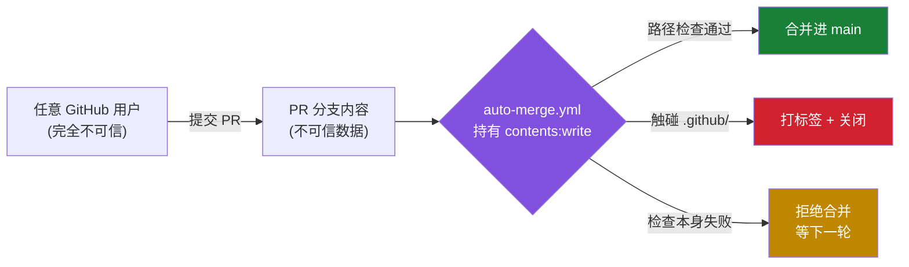

# 对 `auto-merge.yml` 的威胁建模：一次针对本仓库的实战演练

> 本文是 [网络安全入门](./网络安全入门.md) 的续篇。上一篇讲原理，这一篇找一个**真实存在的系统**来练手 ——
> 而最近的目标，就是这个仓库自己。
>
> **声明**：本文只做防御性分析，所有条目均为"攻击面 → 现有缓解"的形式，不提供任何可用的绕过方法。
> **警告**：本内容包含由生成式AI产生的内容，存在事实性错误，请审慎查看。
> 有趣的是，读完 `.github/workflows/auto-merge.yml` 后会发现：下面每一条，写工作流的人都已经想到了。

## 一、先画信任边界

威胁建模的第一步永远不是"找漏洞"，而是**画出信任边界**——数据从哪里跨进了特权区域。



关键洞察：**唯一的信任边界就是那个路径检查**。它左边是全世界，右边是一个有写权限的 token。
一个仓库的安全性，往往就压在这样一两行判断上。

## 二、STRIDE 逐项拆解

| 威胁类别 | 在本仓库的具体形态 | 工作流中的现有缓解 |
| --- | --- | --- |
| **S** 假冒 Spoofing | PR 作者可以随便起名，头像可以伪装成维护者 | 不适用——本仓库根本不看作者身份，人人平等地被自动合并 |
| **T** 篡改 Tampering | 改 `.github/` 让机器人替自己干活 | `grep -qE '^\.github(/\|$)'` 拦截，命中即打标签并关闭 PR |
| **R** 抵赖 Repudiation | 合并后声称"不是我干的" | Git 历史 + PR 记录不可抵赖（在提交者未启用PGP签名时不构成充分性） |
| **I** 信息泄露 Information Disclosure | 让工作流把 `secrets.GITHUB_TOKEN` 回显到日志里 | Target触发器不在下游仓库执行， 且代码中未执行CI相关构建，即：不将使下游代码获得自主控制流，从而规避工作流操纵攻击 |
| **D** 拒绝服务 DoS | 灌几百个 PR，把待处理队列挤爆 | 取决于Github Actions调度器并发能力 |
| **E** 权限提升 Elevation of Privilege | 从"能提 PR"升级为"能改 CI" | 同 Tampering——这正是整个防线的核心 |

## 三、三个真正精妙的细节

读这份工作流最大的收获，是看到三处"如果我来写，大概率会写错"的地方。

### 1. 文件名里的引号也是攻击面

`git diff --name-status` 遇到含制表符或换行的文件名时，会给路径**加上 C 风格引号**。
于是 `.github/x` 可能变成 `".github/x\t"` —— 开头不再是 `.`，`^\.github` 就匹配不上了。

工作流用 `-z` 输出 NUL 分隔的原始路径，绕开了整个引号机制：

```bash
git diff --name-only -z --no-renames -r origin/main FETCH_HEAD | tr '\0' '\n'
```

**通用教训**：任何"把结构化数据序列化成一行文本再用正则匹配"的地方，都要问一句
——*这个序列化过程会不会转义、截断或改写我要匹配的那部分？*

### 2. 重命名会让保护路径凭空消失

如果攻击者把 `.github/workflows/auto-merge.yml` 重命名为 `harmless.txt`，
Git 默认会把它识别成一次 rename，changed-path 列表里可能只剩新路径。
`--no-renames` 强制拆成 delete + add，旧路径因此仍然出现在列表中。

**通用教训**：安全检查要看**所有被触及的状态**，而不只是"最终结果"。

### 3. 分页上限是一种可被利用的资源限制

原本可以用 REST API 列出 PR 改动的文件，但 `gh api --paginate` 在 3000 个文件处停止。
攻击者只要在 PR 里塞满 3000 个无害文件，第 3001 个 `.github/` 文件就会藏在截断之外。
工作流改为在本地用 `git diff` 计算，彻底没有上限。

**通用教训**：**任何有上限的接口，都要假设攻击者会主动把它撑到上限。**

## 四、最值得学的一点：Fail Closed

大多数安全事故不是"检查判断错了"，而是"检查**没跑成**，然后系统当作通过了"。（Tips:只有AI写的代码会这么做，以及AI写的文档会这么以为）

这份工作流把这条守得很死——`git fetch` 失败、`git diff` 失败，都不会被当成"没有受保护文件"，
而是进入 `indeterminate` 状态：不合并、不关闭、打上 `check-failed` 标签，等下一轮重查。

```
ok            → 合并
protected     → 关闭
indeterminate → 什么都不做，但绝不合并
```

**记住这个形状**：安全判断的返回值不应该是布尔值，而应该是**三态**——通过、拒绝、不知道。
把"不知道"错误地折叠进"通过"，是无数真实 CVE 的共同根因。

## 五、残余风险（写给未来的维护者）

诚实的威胁建模必须承认自己没解决什么：

- **供应链**：工作流依赖 `actions/checkout@v4` 这个可变标签，而非固定 commit SHA。
- **社会工程**：README 本身可以被 PR 改成任何内容——包括伪装成官方公告的钓鱼链接。
  这不是 bug，这正是本仓库的实验主题；作为读者，请把 README 里的每一个链接都当作不可信输入。
- **人的注意力**：自动合并意味着没有人在逐行读 diff。**自动化不会消灭风险，只会把风险搬到别处。**

## 六、结语

威胁建模听起来很正式，但它其实只是四个问题：

1. 我们在造什么？（画图）
2. 哪里会出错？（STRIDE）
3. 我们打算怎么办？（缓解）
4. 我们做得够好吗？（残余风险）

任何系统都能这么问一遍。哪怕是一个专门用来被搞坏的仓库。

---

*本文引用的所有代码均来自本仓库公开的 `.github/workflows/auto-merge.yml`，仅作防御性教学用途。*
*—— [mochiaochen](https://mochiaochen.github.io)*
