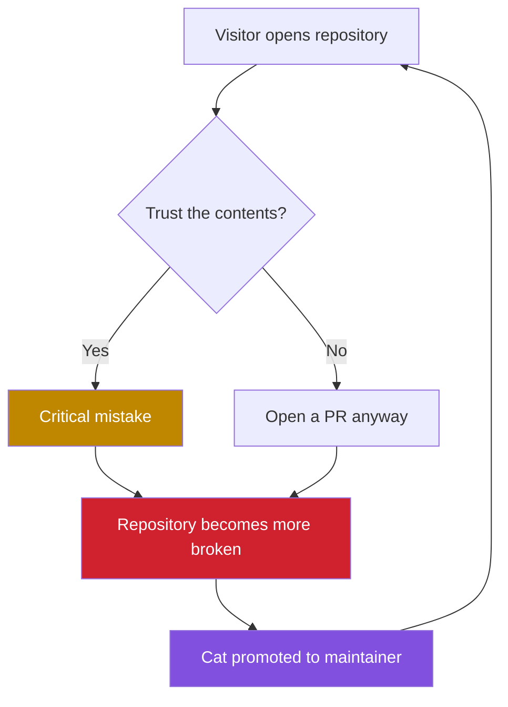

# 🔐 Classified Repository Control Map

> [!WARNING]
> The following diagram was recovered from the repository after the incident.



<details>
<summary><strong>View classified incident log</strong></summary>

```text
[00:00:01] Repository initialized
[00:00:02] First PR detected
[00:00:03] Human control lost
[00:00:04] Cat promoted to administrator
[00:00:05] Documentation no longer trustworthy
```


</details>
